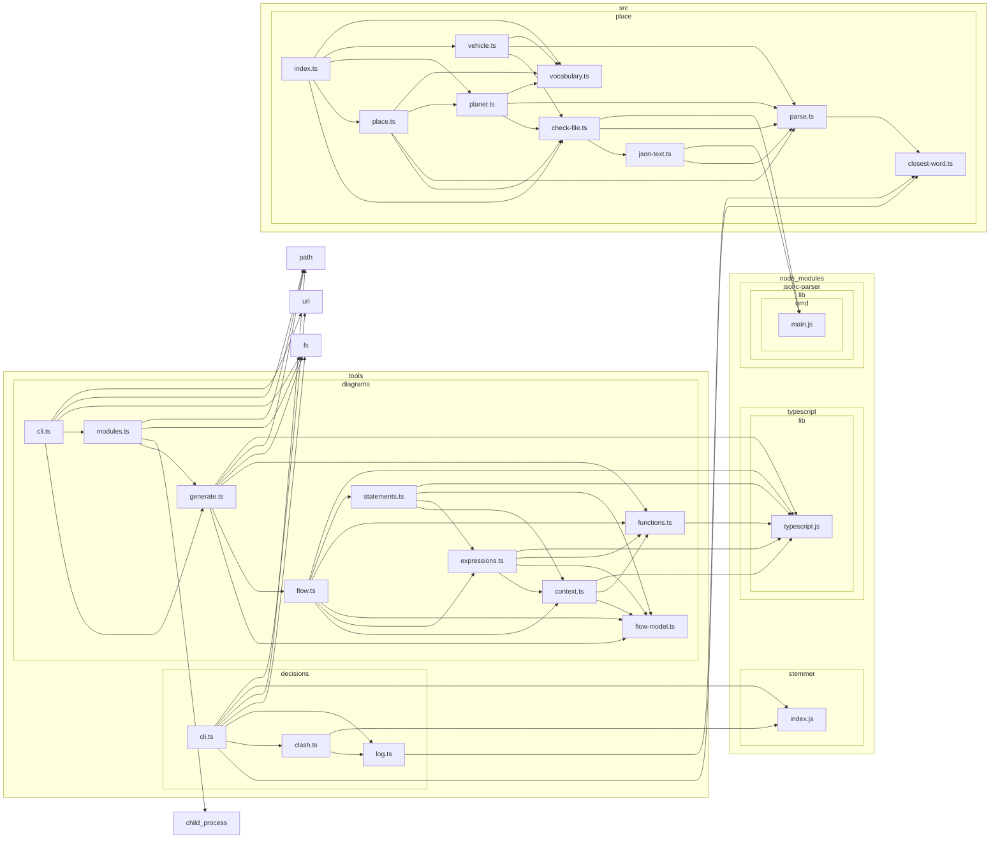

# Module map

Which file uses which, drawn by dependency-cruiser from the imports in the code (`npm run diagrams`). Do not edit by hand.

```mermaid
flowchart LR

subgraph 0["src"]
subgraph 1["place"]
2["check-file.ts"]
8["json-text.ts"]
9["parse.ts"]
A["closest-word.ts"]
B["index.ts"]
C["place.ts"]
D["planet.ts"]
E["vocabulary.ts"]
F["vehicle.ts"]
end
end
subgraph 3["node_modules"]
subgraph 4["jsonc-parser"]
subgraph 5["lib"]
subgraph 6["umd"]
7["main.js"]
end
end
end
subgraph J["stemmer"]
K["index.js"]
end
subgraph T["typescript"]
subgraph U["lib"]
V["typescript.js"]
end
end
end
subgraph G["tools"]
subgraph H["decisions"]
I["clash.ts"]
L["log.ts"]
M["cli.ts"]
end
subgraph Q["diagrams"]
R["cli.ts"]
S["generate.ts"]
W["flow-model.ts"]
X["flow.ts"]
Y["context.ts"]
Z["functions.ts"]
10["expressions.ts"]
11["statements.ts"]
12["modules.ts"]
end
end
N["fs"]
O["path"]
P["url"]
13["child_process"]
2-->8
2-->9
2-->7
8-->9
8-->7
9-->A
B-->2
B-->C
B-->D
B-->F
B-->E
C-->2
C-->9
C-->D
C-->E
D-->2
D-->9
D-->E
F-->2
F-->9
F-->E
I-->L
I-->K
L-->A
M-->A
M-->I
M-->L
M-->N
M-->O
M-->K
M-->P
R-->S
R-->12
R-->N
R-->O
R-->P
S-->W
S-->X
S-->Z
S-->N
S-->O
S-->V
X-->Y
X-->10
X-->W
X-->Z
X-->11
X-->V
Y-->W
Y-->Z
Y-->V
Z-->V
10-->Y
10-->W
10-->Z
10-->V
11-->Y
11-->10
11-->W
11-->V
12-->S
12-->13
12-->N
12-->O
```
