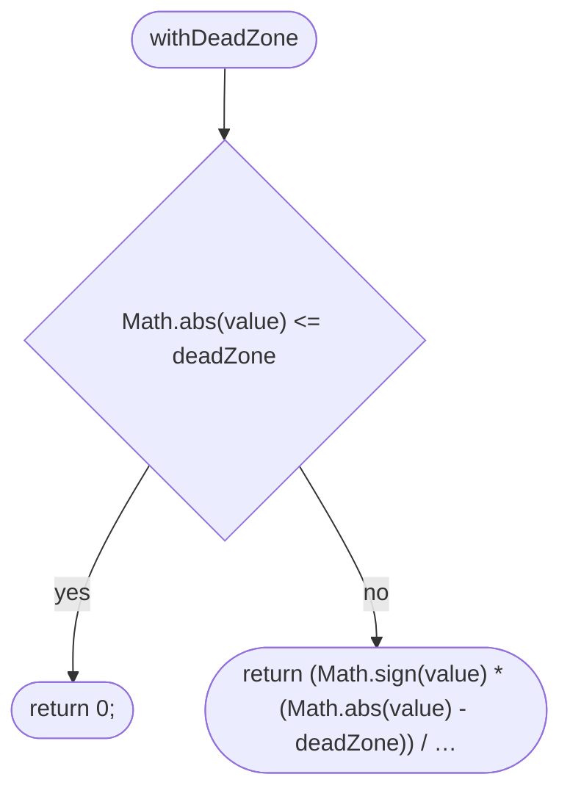
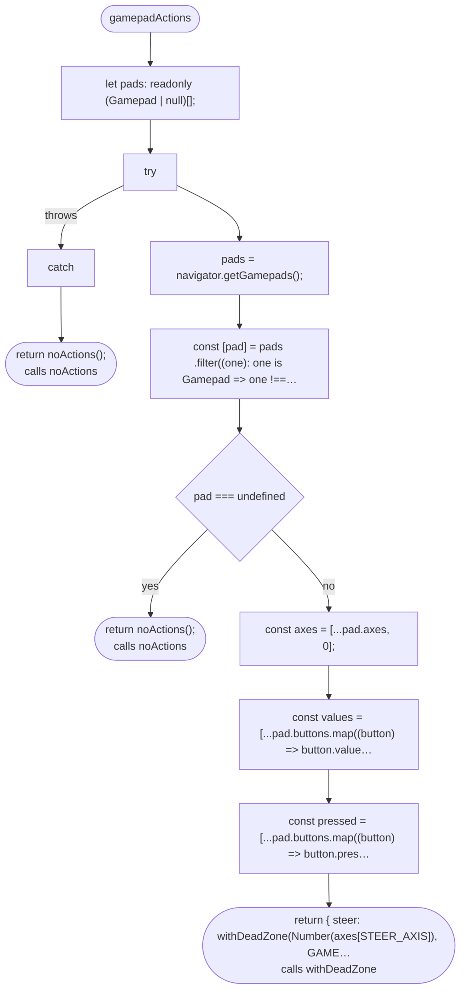

# src/controls/gamepad.ts

Drawn from the code by `npm run diagrams` (TypeScript compiler, no AI). Do not edit by hand: change the code, then run it again.

## withDeadZone

```mermaid
flowchart TD
  n1(["withDeadZone"])
  n2{"Math.abs(value) #lt;= deadZone"}
  n3(["return 0;"])
  n4(["return (Math.sign(value) * (Math.abs(value) - deadZone)) / …"])
  n1 --> n2
  n2 -->|"yes"| n3
  n2 -->|"no"| n4
```

## gamepadActions

```mermaid
flowchart TD
  n1(["gamepadActions"])
  n2["let pads: readonly (Gamepad | null)[];"]
  n3["try"]
  n4["pads = navigator.getGamepads();"]
  n5["catch"]
  n6(["return noActions();<br/>calls noActions"])
  n7["const [pad] = pads .filter((one): one is Gamepad =#gt; one !==…"]
  n8{"pad === undefined"}
  n9(["return noActions();<br/>calls noActions"])
  n10["const axes = [...pad.axes, 0];"]
  n11["const values = [...pad.buttons.map((button) =#gt; button.value…"]
  n12["const pressed = [...pad.buttons.map((button) =#gt; button.pres…"]
  n13(["return { steer: withDeadZone(Number(axes[STEER_AXIS]), GAME…<br/>calls withDeadZone"])
  n1 --> n2
  n2 --> n3
  n3 --> n4
  n3 -->|"throws"| n5
  n5 --> n6
  n4 --> n7
  n7 --> n8
  n8 -->|"yes"| n9
  n8 -->|"no"| n10
  n10 --> n11
  n11 --> n12
  n12 --> n13
```
